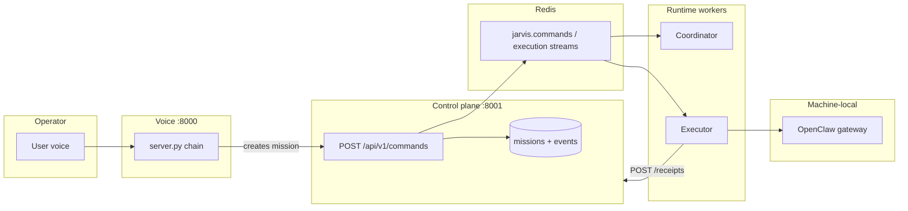
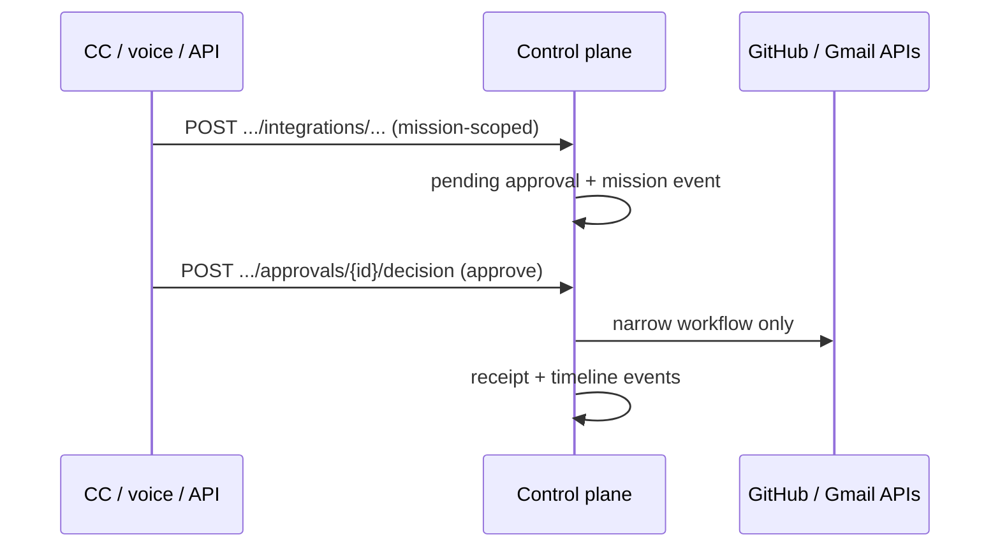
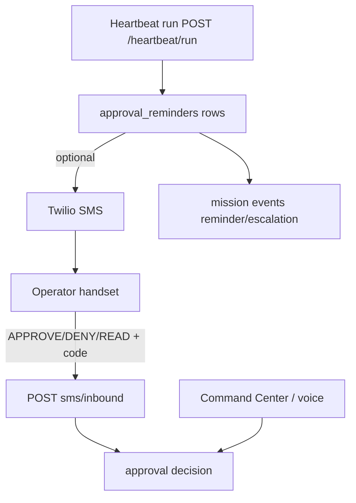
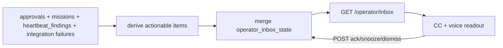

# Architecture V3 — source of truth (implemented system)

**Scope:** This document describes the **current implemented** Jarvis governed stack as reflected in this repository. It does not propose future design. For feature-by-feature status, see [`STATUS.md`](../STATUS.md). For ownership, verification, and honesty rules, see [`REPO_TRUTH.md`](../REPO_TRUTH.md).

## 1. System purpose

**Jarvis** is a **governed operator system**: a **control plane** (PostgreSQL-backed API) holds authoritative **mission, approval, receipt, and operator** state; **Command Center**, **voice**, and optional **SMS** are surfaces that read and act through the same APIs. **Execution** of delegated work runs through **Redis**-mediated handoff to an **executor** that drives **OpenClaw**; **coordinator** and **DashClaw** participate when the Redis policy path is active. **OpenClaw Gateway**, **Ollama**, **Composio**, and **LobsterBoard** are **machine-local or supplemental**—this repo owns integration boundaries and scripts, not those products’ full runtimes.

---

## 2. Service map

| Service | Role | Typical port / transport |
|--------|------|---------------------------|
| **Control plane** | Authoritative HTTP API + Alembic/PostgreSQL: missions, timeline events, approvals, receipts, operator routes, integrations, heartbeat run, SMS inbound webhook | **8001** |
| **Command Center** | React/Vite operator UI: missions, approvals (incl. review **bundle**), inbox, activity, workers, cost, integrations (readiness), evals | **5173** (dev) |
| **Voice server** | FastAPI + WebSocket: STT/TTS; **read-only** briefings; inbox triage; approval readout/decision; governed-action **request** drafts; **`POST /commands`** for new missions (planned: **`POST /api/v1/intake`** on control plane as the single interpreted path) | **8000** |
| **Coordinator** | Stateless consumer: Redis streams ↔ control plane ↔ optional **DashClaw**; publishes execution/updates streams | Env → Redis, HTTP |
| **Executor** | Consumes **`jarvis.execution`**, invokes **OpenClaw CLI**, **`POST /api/v1/receipts`** | Redis consumer |
| **Heartbeat worker** | Calls **`POST /api/v1/heartbeat/run`** (and related) on a schedule; drives supervision + **approval reminders** when configured | Python process + env |
| **SMS (Twilio)** | Outbound approval codes + reminder/escalation copy; **inbound** webhook → approval decisions | Public HTTPS → **8001** webhook path |

**Not application code in this repo:** **Redis**, **PostgreSQL**, **OpenClaw Gateway**, **Ollama**, **DashClaw**, **LobsterBoard** — deployed/configured per machine (see [`DEPLOYMENT_STATUS.md`](../DEPLOYMENT_STATUS.md)).

---

## 3. Machine / deployment boundaries

| Boundary | What crosses it |
|----------|-----------------|
| **Operator device → LAN** | Browser/phone to Command Center, voice HTTP/WebSocket, optional Twilio → public URL for SMS webhook |
| **This repo → `%USERPROFILE%\.openclaw\`** | Gateway config, auth profiles, **live** workspace — **not** fully in git; **tracked mirrors** under `config/workspace/` sync persona/policy |
| **Control plane → vendors** | GitHub REST (`JARVIS_GITHUB_TOKEN`), Gmail API (`JARVIS_GMAIL_*`), Twilio REST — secrets in env, never logged in API responses described as safe |
| **Executor → gateway** | OpenClaw CLI subprocess to **localhost:18789** (typical); model/auth **machine-local** |

---

## 4. Canonical state separation

| Kind | What it is | Authoritative store |
|------|------------|---------------------|
| **Mission state** | Missions, scoped timeline **events**, statuses | PostgreSQL via control plane **only** |
| **Approval state** | Pending/resolved approvals, risk, `action_type`, review **packets** | Same |
| **Receipt / execution metadata** | Agent output, `lane_truth`, cost hooks | Same (`receipts` + derived **cost_events**) |
| **Operator durable memory** | Long-lived **`memory_items`** | Same — **not** mission logs or automatic chat export |
| **Conversational / ephemeral** | Voice WebSocket focus, “read that again”, Ollama **direct** acks | **Not** persisted as mission truth; voice uses CP for reads/writes **only** via explicit API calls |
| **Operator inbox (v1)** | Actionable queue shown in UI/voice | **Derived** from approvals, `heartbeat_findings`, missions, integration failures — merged with **`operator_inbox_state`** (ack/snooze/dismiss), **not** a second mission store |
| **Reminders** | Attempts / escalation tracking | **`approval_reminders`**; tied to heartbeat run when enabled |

---

## 5. Major truth stores (PostgreSQL)

| Store | Purpose |
|-------|---------|
| **missions** (+ mission-scoped **events**) | Mission lifecycle and timeline |
| **approvals** | Human gates; **`approval_sms_tokens`** links SMS codes |
| **receipts** | Execution results; feed **cost_events** when applicable |
| **heartbeat_findings** | Deduped supervision rows (open/resolved) |
| **workers** | Registry + **`last_heartbeat_at`** for registered components |
| **cost_events** | Spend truth (direct / estimated / unknown / not_applicable) |
| **memory_items** | Durable operator memory |
| **operator_inbox_state** | Per-item triage overrides for **derived** inbox |
| **approval_reminders** | Reminder/escalation attempts (with dedupe keys) |

Schema evolution: **Alembic** under `services/control-plane/`.

---

## 6. Major operator surfaces

| Surface | Access pattern | Decisions / writes |
|--------|----------------|---------------------|
| **Web (Command Center)** | REST + SSE (`/api/v1/updates/stream`) | Approvals, inbox triage, governed launchers → same integration POSTs as API |
| **Voice** | WebSocket + HTTP to control plane | **`decided_via: voice`**; governed actions **`requested_via: voice`**; commands → **`POST /api/v1/commands`** |
| **SMS** | Twilio webhook | **`decided_via: sms`**; **explicit** `APPROVE|DENY|READ` + code only |

**Unified intake (v1)** — `POST /api/v1/intake` applies deterministic interpretation (`app/services/intake_interpretation.py`), returns structured `InterpretationResult` + `IntakeReplyBundle`, and routes to existing control-plane services: **`CommandService`** for mission-creating intents, **`ApprovalService.resolve_approval`** when an approval id and decision are resolvable, **operator inbox** state updates for explicit triage, and read-only **mission list** snapshots for status-style queries. **`POST /api/v1/commands`** stays the lower-level primitive that always creates a mission (surfaces that already classified intent can keep using it).

---

## 7. Governed workflow families

| Family | Scope (implemented) | Notes |
|--------|---------------------|--------|
| **GitHub** | Create issue, create **draft** PR, **merge** PR (preflight) | **Red** risk; **no** arbitrary GitHub automation outside these routes |
| **Gmail** | Create draft, create **reply** draft (one message id), **send** existing draft | **Red** risk; not full inbox sync |

Catalog metadata: **`GET /api/v1/operator/action-catalog`** (six actions; **no** secrets).

---

## 8. Canonical approval flow (high level)

1. **Request** — User or automation creates a **pending** approval (governed integration POST, voice draft, coordinator path, etc.).
2. **Review** — Operator uses **bundle** (`GET /api/v1/approvals/{id}/bundle`) on web; voice reads **`spoken_summary`**; SMS uses outbound code.
3. **Decide** — `POST .../decision` with **`decided_via`**: `command_center` | `voice` | `sms` | etc.
4. **Execute** — On approve, control plane runs the **narrow** workflow for that `action_type` (GitHub/Gmail adapters). **No** vendor execution without approval when workflow is red-risk gated.

---

## 9. Canonical voice flow (handler order)

On each utterance, the voice server evaluates in order: **read that again** → **inbox** → **briefing** → **governed action request** → **approval** → **`POST /commands`** → optional **direct Ollama** ack. **Direct Ollama** does **not** populate mission **`routing_decided`** or executor **`lane_truth`** (see [`MODEL_LANES.md`](MODEL_LANES.md)).

---

## 10. Canonical governed action request flow

1. Operator starts from **Command Center** (forms) or **voice** (narrow phrases + field collection) or **scripts**.
2. Client **`POST`** to **`/api/v1/missions/{id}/integrations/...`** as defined in [`INTEGRATIONS_GITHUB.md`](INTEGRATIONS_GITHUB.md) / [`INTEGRATIONS_GMAIL.md`](INTEGRATIONS_GMAIL.md).
3. Control plane creates **`approval_requested`** event + pending approval (**red**).
4. After human approval, server executes **only** the approved workflow step.

---

## 11. Canonical inbox / reminder / escalation flow

- **Inbox items** are **computed** from existing rows/events, then merged with **`operator_inbox_state`** for triage.
- **Reminders** — When **`APPROVAL_REMINDERS_ENABLED`**, **`POST /api/v1/heartbeat/run`** evaluates pending approvals first, writes **`approval_reminders`**, may send SMS using same code infrastructure as initial approval SMS.
- **Escalation** — May surface as **`approval_escalation_pending`** heartbeat findings when escalation SMS was sent and approval remains pending (see [`SMS_APPROVALS.md`](SMS_APPROVALS.md)).

---

## 12. Implemented vs intentionally narrow

| Area | Honest scope |
|------|----------------|
| **Governed GitHub/Gmail** | Narrow REST workflows only; **not** full repo management or inbox products |
| **Composio / OpenClaw plugins** | May exist on gateway; **mission authority** remains control plane |
| **LobsterBoard** | Optional external dashboard; **not** core governed path |
| **Operator evals** | Bounded metrics from DB — **not** subjective model scoring ([`OPERATOR_EVALS.md`](OPERATOR_EVALS.md)) |

---

## Service ownership table

| Service / component | Responsibility | Source of truth owned | External dependencies | Verify |
|--------------------|----------------|-------------------------|------------------------|--------|
| **Control plane** | APIs, persistence, workflows, webhooks | PostgreSQL rows for missions/approvals/receipts/memory/inbox state/reminders/cost/workers | Postgres, Redis (for app), vendor tokens (env) | `GET /health`, `13-rehearse-golden-path.ps1`, `08-final-report.ps1` |
| **Command Center** | Operator UI | **None** (client) | Control plane API | `npm run build` |
| **Voice** | STT/TTS, routing | Ephemeral WS state only | Control plane, optional Ollama | `voice/README.md` |
| **Coordinator** | Stream routing, DashClaw bridge | **None** (derives writes via API) | Redis, DashClaw, control plane | Env + logs; live stack rehearsal |
| **Executor** | Run OpenClaw, post receipts | **None** | Redis, gateway, control plane | `14-rehearse-live-stack.ps1` |
| **Heartbeat worker** | Scheduled supervision + reminder hook | **None** | Control plane API key | `POST /heartbeat/run` docs in `REPO_TRUTH.md` |
| **Twilio SMS** | Deliver + parse approval SMS | **None** (control plane owns tokens table) | Twilio cloud | `SMS_APPROVALS.md` |

---

## Diagrams (truthful, simplified)

### A. Voice utterance → command path → execution (governed mission work)

*Voice may instead hit inbox/approval/governed handlers before `POST /commands`; direct Ollama acks are out of band for `lane_truth`.*

### B. Governed action → approval → execution

### C. Reminder / escalation → surfaces

### D. Inbox derivation + triage

---

## Related docs (deep dives)

| Topic | Doc |
|-------|-----|
| Bring-up, smoke order, minimum stack | [`BRINGUP_RUNBOOK.md`](BRINGUP_RUNBOOK.md) |
| Env vars by service | [`ENV_MATRIX.md`](ENV_MATRIX.md) |
| Tomorrow resume | [`TOMORROW_RESUME.md`](TOMORROW_RESUME.md) |
| Lanes, routing receipts | [`MODEL_LANES.md`](MODEL_LANES.md) |
| SMS + reminders | [`SMS_APPROVALS.md`](SMS_APPROVALS.md) |
| Operator eval metrics | [`OPERATOR_EVALS.md`](OPERATOR_EVALS.md) |
| E2E / smoke | [`E2E_SMOKE_TEST.md`](E2E_SMOKE_TEST.md), [`DEPLOYMENT_STATUS.md`](../DEPLOYMENT_STATUS.md) |
| Golden path rehearsal | [`GOLDEN_PATH.md`](GOLDEN_PATH.md) |
